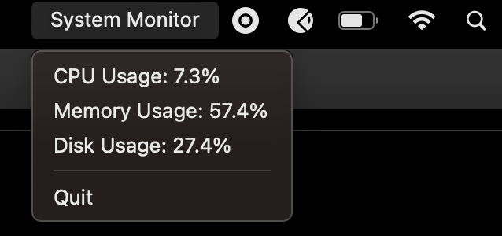

## Gosys

This is simple real-time system monitoring tool on the system tray. It provides the information about the computer's CPU usage, memory usage and disk usage. It updates the metrics every 2 seconds.



## Installation

You can clone this repository and build the binary and then run it. Here are the steps;

#### Steps

1. Clone the repository

```code

git clone https://github.com/root27/gosys

cd gosys

```
2. Install the modules

```code

go mod tidy

```
3. Build the application

```code

go build

```
4. Launch the application

```code

./gosys

```

Also you can download the [binaries](https://github.com/root27/gosys/packages)


